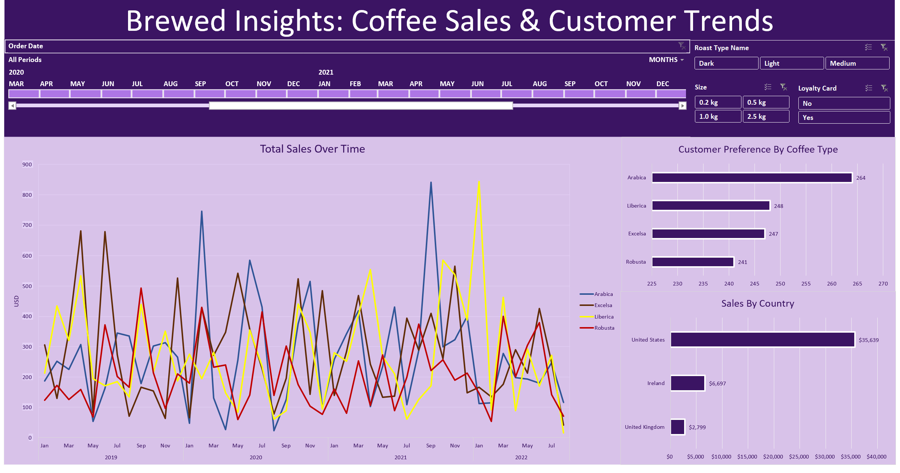

# Brewed Insights: Coffee Sales & Customer Trends

An end-to-end **Microsoft Excel analytics project** that transforms raw coffee order data into an interactive dashboard using lookup formulas, data preparation, PivotTables, PivotCharts, a timeline, and slicers.

## Dashboard Preview



## Project Overview

This project analyzes a multi-year coffee sales dataset and turns separate **orders, customers, and products** sheets into an analysis-ready Excel model and interactive business dashboard.

The workflow includes:

- XLOOKUP for customer and product enrichment
- INDEX-MATCH as an alternative lookup method during the build
- IF / IFS logic for readable category labels and missing-value handling
- Sales calculation using **Unit Price × Quantity**
- Date and number formatting
- Duplicate checks
- Conversion of the range into an Excel Table
- PivotTables and PivotCharts
- Order Date timeline
- Roast Type, Size, and Loyalty Card slicers
- PivotTable source updates and dashboard formatting

## Key Dataset Metrics

- **Sales line records:** 1,000
- **Distinct Order IDs:** 957
- **Customers represented in orders:** 913
- **Product variants:** 48
- **Sales period:** January 2, 2019 – August 19, 2022
- **Total units sold:** 3,551
- **Total sales:** $45,134.26
- **Average sales per line:** $45.13

## Dashboard Analysis

### Total Sales Over Time
Monthly sales are displayed from 2019 through August 2022 across Arabica, Excelsa, Liberica, and Robusta.

### Customer Preference by Coffee Type
- Arabica: **264**
- Liberica: **248**
- Excelsa: **247**
- Robusta: **241**

Customer preference is relatively balanced across all four coffee types.

### Sales by Country
- United States: **$35,638.88**
- Ireland: **$6,696.86**
- United Kingdom: **$2,798.51**

The United States contributes approximately **79% of total sales**.

## Additional Insights

- **Excelsa** generates the highest revenue at $12,306.44.
- **Light roast** generates the most revenue at $17,354.46.
- **2.5 kg** is the highest-value package size, generating $23,785.56.
- Loyalty-card customers generate $20,917.85 versus $24,216.40 from non-card customers.
- 2022 is a partial year ending August 19, so it should not be directly compared with complete prior years.

## Interactive Filters

The dashboard includes:

- Order Date timeline
- Roast Type slicer
- Package Size slicer
- Loyalty Card slicer

These controls update all connected PivotTables and PivotCharts together.

## Files

- [Raw Coffee Orders Data](data/coffee-orders-data.xlsx)
- [Interactive Excel Dashboard](dashboard/Coffee-Sales-Customer-Trends-Dashboard.xlsx)
- [Project Report](report/Excel-Portfolio-Project.pdf)
- [Dashboard Screenshot](images/dashboard-preview.png)

## Repository Structure

```text
brewed-insights-excel-dashboard/
├── README.md
├── data/
│   └── coffee-orders-data.xlsx
├── dashboard/
│   └── Coffee-Sales-Customer-Trends-Dashboard.xlsx
├── images/
│   └── dashboard-preview.png
└── report/
    └── Excel-Portfolio-Project.pdf
```

## Tools & Skills Demonstrated

- Microsoft Excel
- XLOOKUP
- INDEX-MATCH
- IF / IFS
- Excel Tables
- PivotTables
- PivotCharts
- Timeline
- Slicers
- Data cleaning and formatting
- Interactive dashboard design
- Business data analysis

## Author

**Talha Fatir**
